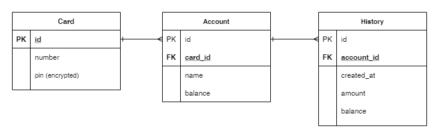

## Simple ATM Controller

### 1. Diagram


### 2. Requests & Responses

- `http://127.0.0.1:8000/atm/register/`
    - request
        ```json
        {
            "card_number":"1234567890123456",
            "pin_number":1111
        }
        ```
    - response
        ```json
      {
            "id": 3,
            "number": "1234567890123456",
            "pin": "pbkdf2_sha256$180000$taDDleWCgEik$P04zPrlgkd44WYQAPLZnG/TW9bA91ID4kWGtNXCARvo="
      }
      
        ```
      
- `http://127.0.0.1:8000/atm/authenticate/`
    - request
        ```json
        {
            "card_number":"1234567812345678",
            "pin_number":1111
        }
        ```
    - response
        ```json
        {
            "auth": "success"
        }
        ```
        ```json
        {
            "auth": "failed"
        }
        ```

- `http://127.0.0.1:8000/atm/create-account/`
    - request
        ```json
        {
            "name" : "MyAccount2"
        }
        ```
    - response
        ```json
          {
            "id": 5,
            "card": 1,
            "name": "MyAccount2",
            "balance": 0
          }
        ```
        ```json
        {
            "auth": "failed"
        }
        ```

- `http://127.0.0.1:8000/atm/deposit-withdrawal/`
    - request
        ```json
      {
            "account_name":"MyAccount",
            "amount":500
      }
        ```
    - response
        ```json
        {
            "id": 4,
            "account": 4,
            "created_at": "2021-01-09 22:35:44.986185",
            "amount": 500,
            "balance": 2000
        }
        ```
        ```json
        {
            "auth": "failed"
        }
        ```

- `http://127.0.0.1:8000/atm/accounts/`
    - request
        ```json

        ```
    - response
        ```json
      [
            {
                "id": 1,
                "card": 1,
                "name": "",
                "balance": 0
            },
            {
                "id": 2,
                "card": 1,
                "name": "",
                "balance": 0
            },
            {
                "id": 3,
                "card": 1,
                "name": "",
                "balance": 0
            },
            {
                "id": 4,
                "card": 1,
                "name": "MyAccount",
                "balance": 2000
            },
            {
                "id": 5,
                "card": 1,
                "name": "MyAccount2",
                "balance": 0
            }
      ]
        ```
        ```json
        {
            "auth": "failed"
        }
        ```

- `http://127.0.0.1:8000/atm/history/`
    - request
        ```json
      {
            "account_name":"MyAccount"
      }
        ```
    - response
        ```json
        [
            {
                "id": 1,
                "account": 4,
                "created_at": "2021-01-09 22:17:57.192065",
                "amount": 500,
                "balance": 500
            },
            {
                "id": 2,
                "account": 4,
                "created_at": "2021-01-09 13:20:20.850698",
                "amount": 500,
                "balance": 1000
            },
            {
                "id": 3,
                "account": 4,
                "created_at": "2021-01-09 13:20:38.451699",
                "amount": 500,
                "balance": 1500
            },
            {
                "id": 4,
                "account": 4,
                "created_at": "2021-01-09 22:35:44.986185",
                "amount": 500,
                "balance": 2000
            },
            {
                "id": 5,
                "account": 4,
                "created_at": "2021-01-09 23:47:44.028814",
                "amount": -1000,
                "balance": 1000
            }
        ]
        ```
        ```json
        {
            "auth": "failed"
        }
        ```
